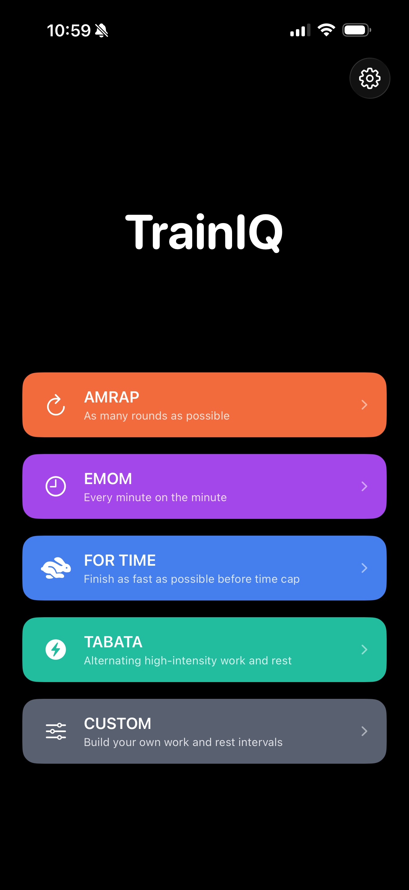
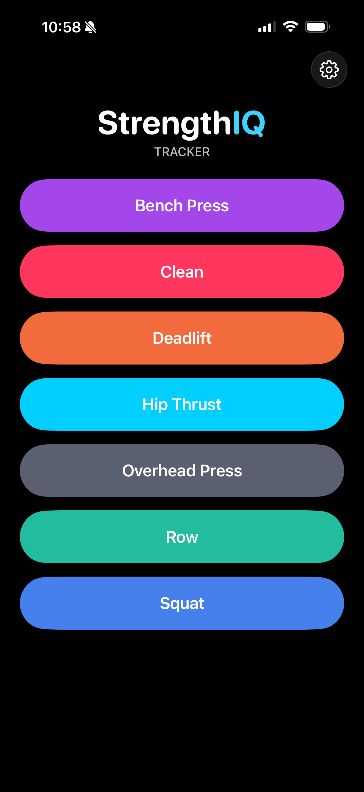

A few hours into building my first iOS app, my AI coding assistant suggested I store user data in a cloud database I hadn't asked for, didn't need, and would have created a privacy mess. The code worked, but the architecture was wrong. I'd been a cloud security professional for two decades, and I almost just went along with it.

## Who I Am and What I Built

For context, I lead a team of Customer Engineers at Google supporting the Wiz cloud security platform, which Google acquired earlier this year. I've worked in the technology industry for two decades, and in cloud security for the past several years.

One of the things I enjoy most about this industry is that it forces you to constantly learn and test yourself. A few years ago I decided to go deeper on software development — specifically the security side of application development. I'm not a traditional engineer; I don't have a CS degree and I've never worked as a developer. But I'd always been drawn to the idea of building things, and the rise of AI coding assistants made it finally feasible.

My first app, TrainIQ, came out of frustration with a free interval timer I'd been using to time my workouts. Every time I started a timer, an ad popped up. The app's real purpose wasn't to time workouts — it was to serve ads. So with the help of Cursor, I built my own: focused, privacy-first, no ads, no tracking. From initial plan to working prototype took about half a day.

I later built a second app, StrengthIQ, a strength training log that takes the same privacy-first approach — all workout data stays on the device, with nothing sent to the cloud.

That's when I started noticing some interesting — and concerning — patterns.

**Pattern 1 — Cloud sprawl by default.** AI coding assistants are trained on Stack Overflow and GitHub, where the dominant pattern is "store everything in the cloud." When you ask one to build a feature, it will reach for cloud storage, third-party APIs, and analytics SDKs without being asked. For a privacy-first app like StrengthIQ, this meant constantly redirecting the AI back to on-device storage. The lesson isn't that the AI is wrong — it's that *secure defaults are not free*. Someone has to know what the default should be.

**Pattern 2 — The "looks right" failure mode.** Code that *runs* is not the same as code that's *secure*. AI-generated code has a particular failure mode: it's syntactically accurate, well-commented, and follows the surface conventions of the language, which makes it look reviewed. But the security properties are inconsistent. I've watched coding assistants hardcode API keys directly into source files, write error messages that leak implementation details back to the user, and skip input validation on fields a user could easily manipulate. None of these would have failed a build. All of them would have failed a real code review.

**Pattern 3 — Confident hallucination of APIs and permissions.** AI tools will sometimes invent iOS APIs that don't exist, or get permission models subtly wrong — for example, suggesting a HealthKit integration that would require entitlements the app doesn't have. For a privacy-first app, being "subtly wrong" about permissions and entitlements can have major consequences.

## Why This Matters

You might wonder why I'm writing about my experience building a couple of iOS apps, and how this relates to enterprise cloud security. In a nutshell, the security and privacy issues I saw building my apps are significantly amplified at scale. The security teams at the enterprises we work with are seeing these same patterns play out across hundreds — sometimes thousands — of developers:

- Agentic coding tools like Claude Code, Cursor, and Codex don't just suggest. They act, and this multiplies the risk. The pattern shifts from "did I review this?" to "did I notice this happened?"
- The skill that matters most isn't prompt engineering. It's **architectural judgment** — knowing what the system *should* look like before you ask the AI to build it.
- This is also a teaching problem, which is part of why I've started thinking more about it publicly. We're going to need a generation of developers who can supervise AI tools, not just use them — and the training and enablement for that doesn't really exist yet.

## What I'd Tell Security Teams Today

A few practical takeaways from what I've seen in the field, reinforced by what I've seen building my own apps:

- **Invest in developers who can describe a system architecture, not just type code.** That skill is becoming the bottleneck.
- Assume your developers are already using AI coding tools, whether sanctioned or not.
- Threat-model the **defaults** of the AI tools your teams use, not just the code they produce.
- Add an "AI-assisted code" lens to your code review process — it asks different questions than reviews of human-written code.
- For agentic tools specifically: log everything the agent does, and treat it like a human contractor with admin access until proven otherwise.

The people who will be the most successful in cybersecurity over the next few years aren't the ones who refuse to use AI tools, or the ones who use them blindly. They're the ones who can supervise them with judgment. That's what we need to be teaching now.

What patterns are you seeing in your own AI-assisted development? Curious to hear what others are running into.